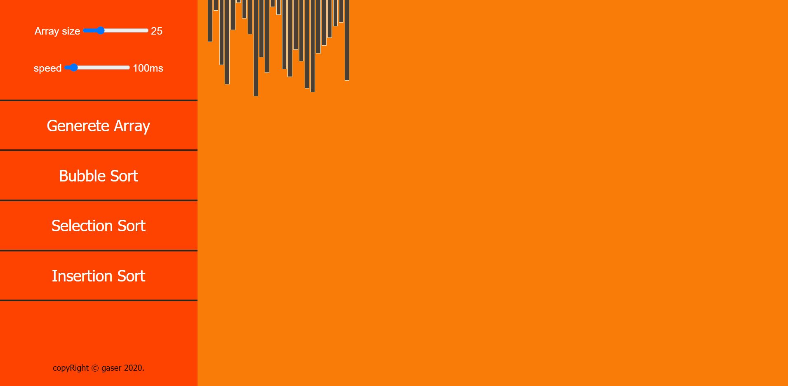

# Sorting-Visualizer
🧮 Sorting Visualizer is a app for visualizing a different sorting algorithms Like Bubble Sort, Selection Sort and Insertion Sort and you can control the array size and the Speed
## Build with
* vanilla javascript
## Screen Shots

